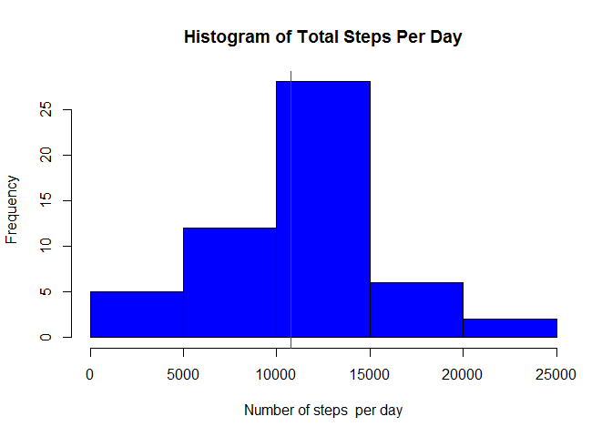
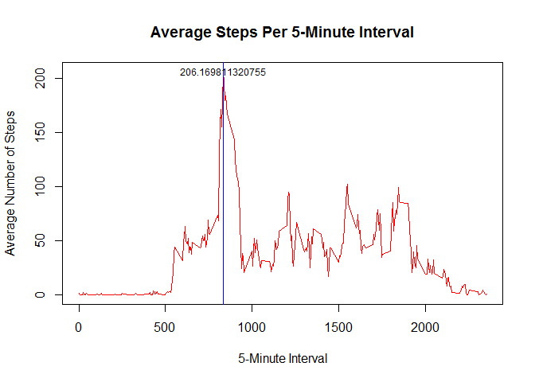
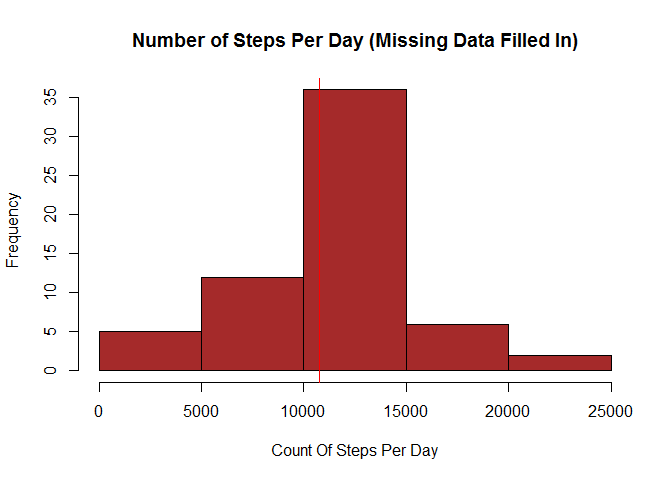
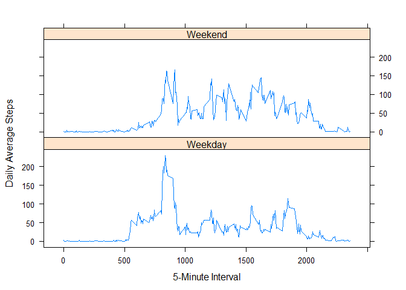

# ANALYSIS OF PERSONAL MOVEMENT DATA USING ACTIVITY MONITORING DEVICES
          REPRODUCIBLE RESEARCH  
          
    JOHN HOPKINS UNIVERSTY THROUGH COURSERA
        
        October 1st - November 29th, 2014 
        
            Peer Assessment 1

             Oscar Portillo


# Project Description:

The following report analyzes data about personal movement collected by activity monitoring devices such as a Fitbit, Nike Fuelband, orJawbone Up. These type of devices are part of the "quantified self" movement - a group of enthusiasts who take measurements about themselves regularly to improve their health, to find patterns in their behavior, or because they are tech geeks. But these data remain under-utilized both because the raw data are hard to obtain and there is a lack of statistical methods and software for processing and interpreting the data.

The data is reported at 5 minute intervals through out the day. The data consists of two months of data from an anonymous individual collected during the months of October and November, 2012 and include the number of steps taken in 5 minute intervals each day.


## 1) Loading and preprocessing the data

A folder named ActivityData is created in the current home directory. Then the dataset ActivityMonitoringData is downloaded, unzipped, and stored in the ActivityData folder.

```r
if(!file.exists("ActivityData")) { dir.create("ActivityData")}

zipUrl <- "http://d396qusza40orc.cloudfront.net/repdata%2Fdata%2Factivity.zip"
download.file(zipUrl,destfile="./ActivityData/ActivityMonitoringData.zip")
unzip("./ActivityData/ActivityMonitoringData.zip",exdir="./ActivityData",overwrite=TRUE)
```
The next step consists of reading the data into R and taking a quick overview of the dataset.

```r
activity_dataset = read.csv("./ActivityData/activity.csv", sep=",",              stringsAsFactors = F)
str(activity_dataset)
```

```
## 'data.frame':	17568 obs. of  3 variables:
##  $ steps   : int  NA NA NA NA NA NA NA NA NA NA ...
##  $ date    : chr  "2012-10-01" "2012-10-01" "2012-10-01" "2012-10-01" ...
##  $ interval: int  0 5 10 15 20 25 30 35 40 45 ...
```

```r
summary(activity_dataset)
```

```
##      steps           date              interval   
##  Min.   :  0.0   Length:17568       Min.   :   0  
##  1st Qu.:  0.0   Class :character   1st Qu.: 589  
##  Median :  0.0   Mode  :character   Median :1178  
##  Mean   : 37.4                      Mean   :1178  
##  3rd Qu.: 12.0                      3rd Qu.:1766  
##  Max.   :806.0                      Max.   :2355  
##  NA's   :2304
```

```r
head(activity_dataset,3)
```

```
##   steps       date interval
## 1    NA 2012-10-01        0
## 2    NA 2012-10-01        5
## 3    NA 2012-10-01       10
```
As the reader can see above, there are 3 variables included in the data:

1.-steps: Number of steps taking in a 5-minute interval (missing values are coded as NA)

2.-date: The date on which the measurement was taken in YYYY-MM-DD format

3.-interval: Identifier for the 5-minute interval in which measurement was taken

There are a total of 17568 observations. The variable "date" is type "chr". The date column is converted to data-format type Date:

```r
activity_dataset$date <- as.Date(activity_dataset$date, "%Y-%m-%d")
```

##2) What is mean total number of steps taken per day?

The data is organized by date and the mean and median is computed afterwards. 

```r
# Split the date by days via "aggregate" function
steps_per_day_sum <- aggregate(steps ~ date, data = activity_dataset, sum, na.rm=TRUE)
mean_steps_per_day = as.integer(mean(steps_per_day_sum$step, na.rm = TRUE))
median_steps_per_day = as.integer(median(steps_per_day_sum$step, na.rm = TRUE))
# Generate a histogram of the total number of steps taken each day
hist(steps_per_day_sum$steps, main="Histogram of Total Steps Per Day",
     xlab = "Number of steps  per day", col="blue" ) 
# Add mean and median to histogram
abline(v=mean_steps_per_day, col="green")
abline(v=median_steps_per_day, col="red")
```

 

The results show that the mean and median are pretty close each other: the total steps per day is 10766 and the median is 10765 steps.

##3) What is the average daily activity pattern?

The data is now organized by intervals, so that the analysis of steps is conducted on interval-base

```r
# Split activity moving data by daily time series
daily_steps_interval <- aggregate(steps ~ interval, data = activity_dataset, mean)
# Generate a plot of the average of steps taken each 5-minute interval
plot(daily_steps_interval$interval, daily_steps_interval$steps, type = "l",
     col="red", main = "Average Steps Per 5-Minute Interval", xlab = "5-Minute Interval", ylab = "Average Number of Steps")

# Add a vertical line represeinting the 5-minute interval that contains the maximum number of steps

abline(v = daily_steps_interval[daily_steps_interval$steps == max(daily_steps_interval$steps), 1], col = "blue")

## Add an annotation about this maximum data point.

text(x = daily_steps_interval[daily_steps_interval$steps == max(daily_steps_interval$steps),1], y = max(daily_steps_interval$steps), labels= max(daily_steps_interval$steps), cex= 0.75, offset = 10)
```

 

The which.max function is used to find the interval with the highest average number of steps


```r
maximun_step_interval<-daily_steps_interval[which.max(daily_steps_interval$steps), "interval"]
```

The 835th interval contains the maximum number of steps, it matches what we see in the line plot above.

## 4) Imputing missing values

As we observed from the initial summary, there are many NAs in the step column. The exact number is computed below:


```r
# Find the number of NAs values
NA_count = sum(is.na(activity_dataset$steps))
```

The are 2304 missing values in the dataset. 

The missing values will be filled with the average for that interval accross all days.
 

```r
# Fill the missing values with mean steps of that interval. First, make a copy of the dataset, to work with the copy and replace the NA values with the mean
complete_activity_dataset<- activity_dataset

for (i in 1:length(complete_activity_dataset$steps)) 
  {
       if (is.na(complete_activity_dataset$steps[i])) 
         {
               mean_activity <- daily_steps_interval[daily_steps_interval$interval == complete_activity_dataset$interval[i], 2]
               
               complete_activity_dataset$steps[i] <- mean_activity 
          }        
 }

# Plot a histogram of the total number of steps taken each day for the new dataset wth the missing data filled in.

complete_sum_steps_per_day <- aggregate(steps ~ date, data = complete_activity_dataset, sum)

# The mean and median are recomputed for reporting and plotting purposes 
complete_mean_steps = as.integer(mean(complete_sum_steps_per_day$step, na.rm = TRUE))

complete_median_steps = as.integer(median(complete_sum_steps_per_day$step, na.rm = TRUE))

# Plot a histogram and add a vertical line for the mean and median

hist(complete_sum_steps_per_day$steps, col="brown", main="Number of Steps Per Day (Missing Data Filled In)", xlab = "Count Of Steps Per Day")
# Add new mean and median to the Histogram

abline(v=complete_mean_steps, col="green")
abline(v=complete_median_steps, col="red")
```

 

Using the new data with NA-values rapleced by the mean of the interval, one can observe that the mean did not change, it is still 10766 whereas the median incresed in 1 unit, its new value is 10766.

##5) Are there differences in activity patterns between weekdays and weekends?

The data is partitioned by weekday or weekend and time interval. The mean of steps for each pair of week day or weekend day and time interval is calculated. A lattice plot is used to create a panel plot of the 5-minute interval and average number of steps taken, averaged across all weekdays or weekend days.


```r
# Create a vector with the weekday and weekend day-type labels

weekdays_label = c("Monday", "Tuesday", "Wednesday", "Thursday", "Friday")
weekends_label = c("Saturday", "Sunday")

# Incorporate the labels to the dataset.The function weekday() is called. This function extracts the weekday name, i.e. returns a character vector of day name 
week_label = vector()
complete_activity_dataset$date <- weekdays(complete_activity_dataset$date)

for (i in 1:length(complete_activity_dataset$date))
  {
        if (complete_activity_dataset$date[i] %in% weekdays_label)
          {
                week_label = c(week_label, "Weekday")  
           }
        else
          {
                week_label = c(week_label, "Weekend")  
          }
  }

complete_activity_dataset <- transform( complete_activity_dataset, weekday_type = week_label)

# Finally, the data is splitted by week label and time interval. After that,  mean steps is calculated and panel plot generated

steps_interval_mean <- aggregate(steps ~ interval + weekday_type, data = complete_activity_dataset, mean)

library(lattice)

xyplot(steps ~ interval|weekday_type, data = steps_interval_mean, type = "l", xlab = "5-Minute Interval", ylab = "Daily Average Steps", layout=c(1,2))
```

 

One can observe that there is indeed a different activity pattern between weekends and weekdays.The average step count appears more uniform throughout the weekend days and shows smaller peaks. The plot indicates that movement activity peaks (max. average step per day) during the same interval both during weekends and weekdays. It also seems that activity is more centered about 4 peaks during weekdays, in contrast, it has more variability on weekends. 
